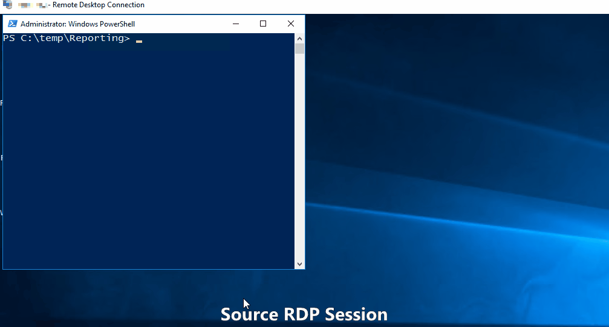

# Copy-FileToRestrictedRDP
This Script Converts a File to a Base64 String and generates a powershell command to let you copy it via RDP to another Source PC

## But Why?
Some administrator restricted file copy between RDP sessions but didn't restrict text copy between rdp sessions. This script generates a base64 string and saves it to clipboard. You can then paste the text in a powershell window at the source to save the file

## And How?
Open a powershell on the source RDP session and paste the function from "Copy-FileToRestrictedRDP.psm1"
then use for example:
´´´
Copy-FileToRestrictedRDP C:\temp\certs.zip
´´´

here is a gif that shows whats happening

